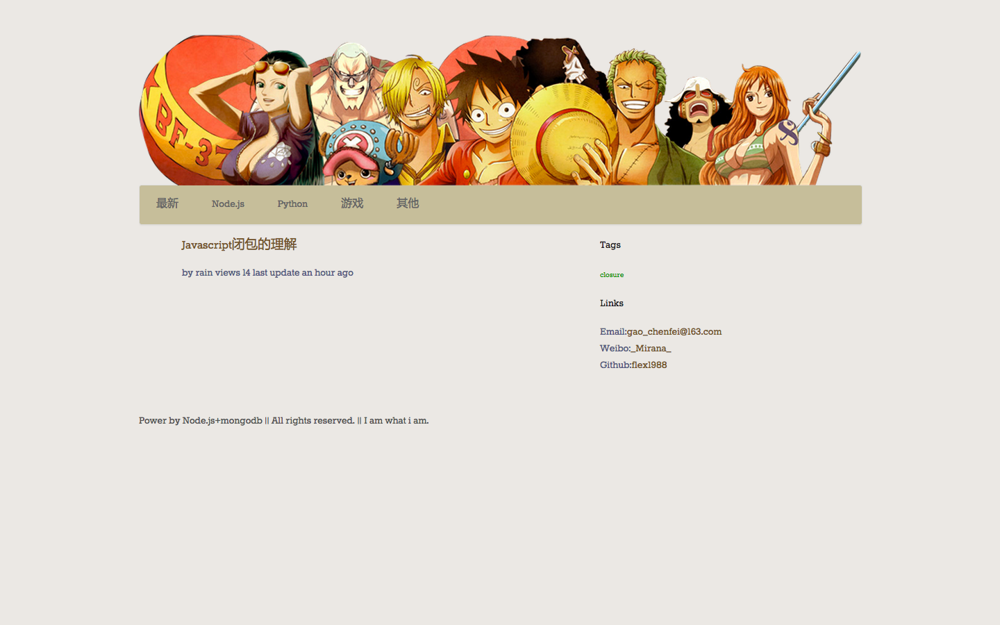

nodejs koa MVC blog
-----
一个基于Nodejs koa的博客网站，使用MVC风格的代码架构。

demo：http://www.mirana.me

tree structure
-----
├── bin                 #启动脚本
├── controller          #业务逻辑中间件
├── model               #mongoose Schema
├── public              #static folder
│   ├── fonts           #字体
│   ├── image           #图片
│   ├── js              #js
│   ├── stylesheets     #css
│   └── upload          #上传文件夹
│       └── images
├── server              #server服务端core代码
│   └── common          #server用到的闭包代码
└── view                #Jade模板
    ├── auth
    ├── blog
    └── common
    
feature&require
-----
* markdown格式支持
* foundation5 theme 扁平化响应式的前端CSS框架
* highlight.js 代码高亮
* MVC代码风格
* 多用户支持
* jade模板引擎
* disqus评论
* markdown editor
* Node 0.11.x 
* mongoose mongodb ORM module

install&&run
-----
    1. npm install -g pm2
    2. git clone https://github.com/flex1988/Node_blog_V2.git
    3. cd Node_blog_V2
    4. npm install
    5. chmod u+x ./bin/run.sh
    6. ./bin/run.sh
screenShot
-----

